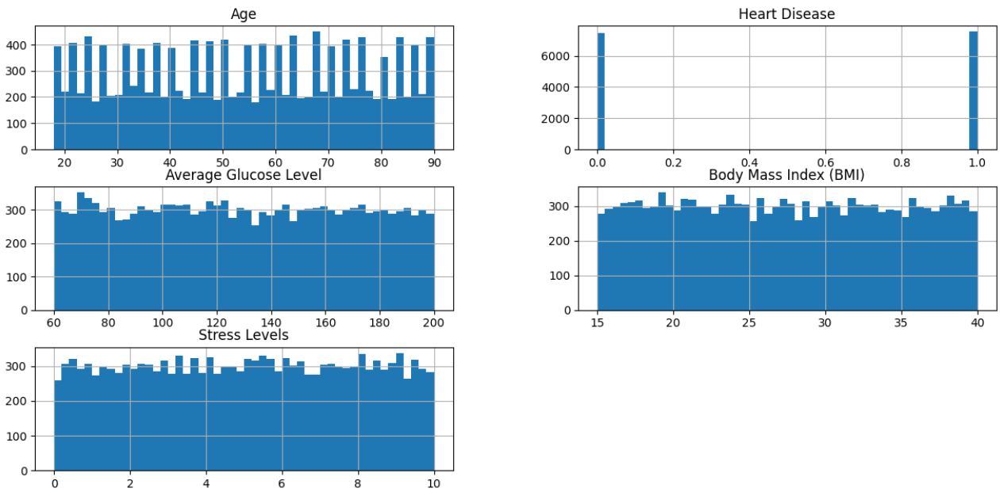
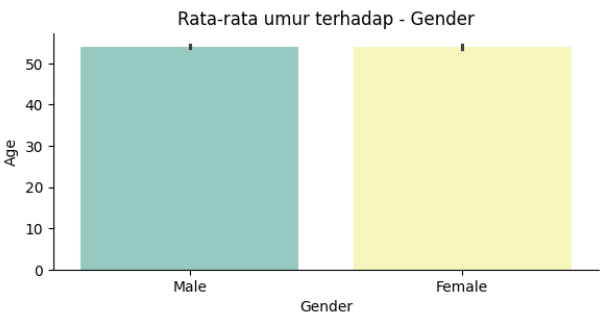
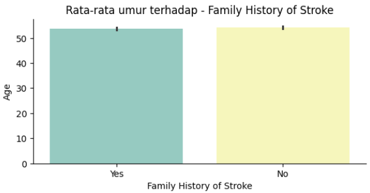
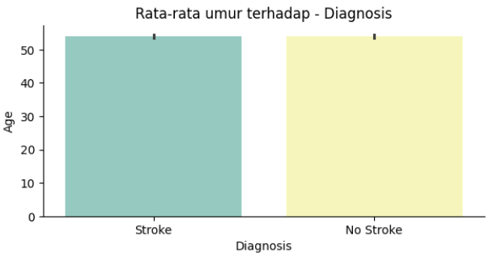
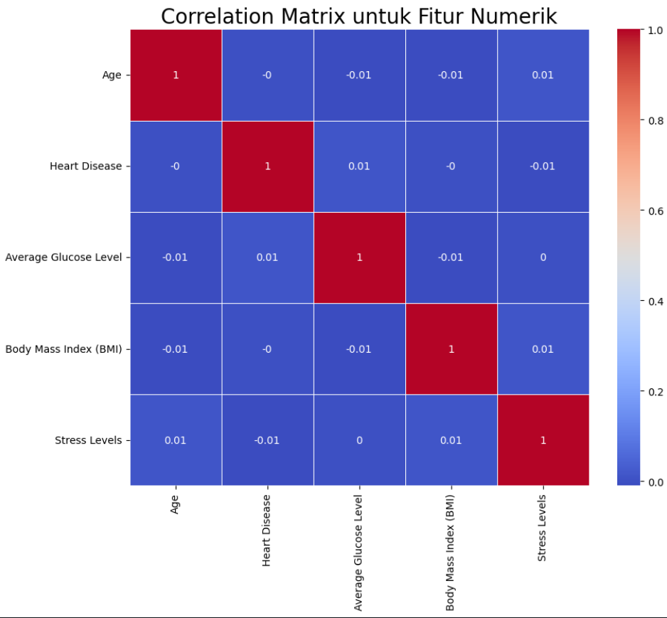
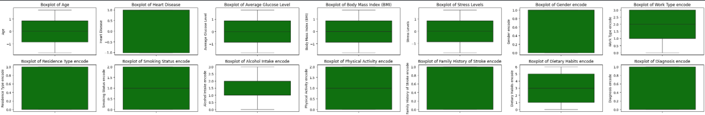

# Laporan Proyek Machine Learning Prediksi Stroke Berdasarkan Kebiasaan Sehari-hari - Fajri Haryanto

---

## 🌍 Domain Proyek

Stroke merupakan salah satu penyakit yang memiliki tingkat kematian dan kecacatan tertinggi secara global. Organisasi Kesehatan Dunia (WHO) mencatat bahwa sekitar 15 juta orang di dunia mengalami stroke setiap tahunnya, dan sepertiganya mengalami kematian [1]. Di Indonesia, prevalensi stroke juga cukup tinggi, khususnya pada kelompok usia produktif. Hal ini menimbulkan dampak sosial dan ekonomi yang besar, baik bagi individu, keluarga, maupun negara [2].

Prediksi stroke secara dini menjadi krusial untuk menurunkan angka kejadian dan mempercepat intervensi medis. Namun, pemeriksaan konvensional seperti CT-scan atau MRI umumnya hanya dilakukan ketika gejala sudah muncul. Oleh karena itu, pendekatan prediksi berbasis machine learning (ML) menggunakan data kebiasaan sehari-hari dan faktor demografis dinilai lebih adaptif, ekonomis, dan mudah diakses.

Dalam proyek ini, **dikembangkan sebuah sistem prediksi risiko stroke dengan memanfaatkan algoritma Random Forest/KNN, Boosters Algorithm**. Model ini dilatih menggunakan data demografis (usia, jenis kelamin), gaya hidup (kebiasaan merokok, aktivitas fisik), serta kondisi kesehatan (tekanan darah, diabetes, dan lain-lain) untuk mengidentifikasi individu dengan potensi risiko tinggi terhadap stroke.

### ⚠️ Urgensi Masalah

Deteksi dini terhadap risiko stroke memiliki peran penting dalam proses pencegahan dan pengobatan. Sayangnya, masih banyak masyarakat yang tidak menyadari bahwa gaya hidup sehari-hari berperan besar dalam meningkatkan risiko stroke. Selain itu, akses terhadap teknologi diagnostik masih terbatas, terutama di daerah dengan fasilitas kesehatan minimal.

Dengan meningkatnya ketersediaan data kesehatan dan kemajuan teknologi ML, muncul peluang untuk mengembangkan sistem prediktif yang mampu memberikan peringatan dini secara otomatis dan akurat. Penelitian ini mencoba menjawab kebutuhan tersebut dengan mengembangkan model prediksi stroke berbasis data kebiasaan harian.

### 🎯 Tujuan Penelitian

Tujuan dari proyek ini adalah:

1. Menganalisis dan mengolah data kebiasaan sehari-hari dan data demografis untuk membangun model prediksi risiko stroke.

2. Mengimplementasikan algoritma Random Forest untuk menghasilkan klasifikasi yang akurat antara individu berisiko dan tidak berisiko stroke.

3. Memberikan solusi yang dapat membantu masyarakat dan tenaga medis dalam melakukan deteksi dini secara digital dan preventif.

---

## 📊 Business Understanding

Pemahaman bisnis merupakan langkah krusial dalam pengembangan sistem prediksi berbasis machine learning. Tahapan ini berfokus pada klarifikasi permasalahan yang hendak diselesaikan serta perumusan tujuan yang ingin dicapai, agar model yang dikembangkan dapat memberikan nilai nyata dalam konteks dunia nyata dalam hal ini, prediksi risiko stroke berdasarkan kebiasaan sehari-hari dan faktor demografis.

### ❓ Problem Statements

1. Kurangnya deteksi dini risiko stroke di masyarakat.  
   Banyak individu tidak sadar risiko tinggi stroke akibat keterbatasan akses pemeriksaan medis dan rendahnya kesadaran faktor risiko sehari-hari.

2. Data kesehatan yang tersedia masih mentah dan belum siap prediksi.  
   Data mengandung outlier, nilai kosong, dan fitur tidak seragam sehingga perlu pembersihan dan transformasi agar ML dapat mempelajarinya efektif.

3. Belum ada model pembanding teruji untuk menentukan algoritma optimal.  
   Tanpa evaluasi sistematis, pemilihan algoritma bisa menghasilkan prediksi tidak akurat dan tidak dapat diandalkan.

### 🎯 Goals

1. Mengembangkan model prediktif yang akurat mengidentifikasi individu berisiko tinggi stroke, memberikan peringatan dini berdasarkan gaya hidup dan kondisi kesehatan.
2. Melakukan eksplorasi dan transformasi data (EDA, penanganan outlier, encoding, normalisasi) agar data siap untuk pelatihan model.
3. Membandingkan performa algoritma Random Forest, KNN, dan Booster Algorithm untuk memilih model dengan akurasi dan generalisasi terbaik.

### 💡 Solution Statements

1. Menggunakan dan mengevaluasi tiga algoritma klasifikasi:

   - **Random Forest**
   - **K-Nearest Neighbors (KNN)**
   - **Booster Algorithm (Gradient Boosting)**

Ketiga algoritma dipilih karena pendekatan berbeda dalam klasifikasi, memungkinkan perbandingan performa menggunakan metrik akurasi, precision, recall, dan F1-score.

2. Melakukan preprocessing menyeluruh meliputi:

   - **Exploratory Data Analysis (EDA):** Memahami distribusi data dan hubungan antar fitur.
   - **Outlier Handling:** Menggunakan metode IQR untuk mengurangi pengaruh nilai ekstrem.
   - **Encoding fitur kategorikal:** Label Encoder atau One-Hot Encoding untuk data numerik yang dipahami algoritma.
   - **Normalisasi fitur:** StandardScaler untuk menyamakan skala nilai dan menghindari bias model terhadap fitur tertentu.
   - **Split Data 80:20:** Memisahkan data latih dan uji untuk evaluasi objektif.

3. Evaluasi performa model menggunakan metrik:
   - **Accuracy**
   - **Precision**
   - **Recall**
   - **F1-score**  
     Sehingga pemilihan model terbaik bukan hanya berdasarkan akurasi, tetapi juga kemampuan mendeteksi kelas minoritas (stroke).

---

## 📊 Data Understanding

Dataset yang digunakan dalam penelitian ini diambil dari Kaggle: [Stroke Prediction Dataset](https://www.kaggle.com/datasets/teamincribo/stroke-prediction). Dataset ini telah dimodifikasi dengan menambahkan beberapa fitur penting yang relevan untuk meningkatkan akurasi prediksi risiko stroke.

Dataset ini berisi **15.000 baris** dan **22 fitur awal**, mencakup data demografis, gaya hidup, serta riwayat kesehatan pasien.

## 🧱 Struktur Awal Dataset

| No  | Nama Fitur               | Tipe Data | Keterangan                                       |
| --- | ------------------------ | --------- | ------------------------------------------------ |
| 1   | Patient ID               | int64     | Nomor identitas unik pasien                      |
| 2   | Patient Name             | object    | Nama pasien (informasi pribadi)                  |
| 3   | Age                      | int64     | Usia pasien                                      |
| 4   | Gender                   | object    | Jenis kelamin                                    |
| 5   | Hypertension             | int64     | Riwayat hipertensi (0 = tidak, 1 = ya)           |
| 6   | Heart Disease            | int64     | Riwayat penyakit jantung (0 = tidak, 1 = ya)     |
| 7   | Marital Status           | object    | Status pernikahan                                |
| 8   | Work Type                | object    | Jenis pekerjaan                                  |
| 9   | Residence Type           | object    | Jenis tempat tinggal (Urban/Rural)               |
| 10  | Average Glucose Level    | float64   | Rata-rata kadar glukosa darah (mg/dL)            |
| 11  | BMI                      | float64   | Indeks massa tubuh (Body Mass Index)             |
| 12  | Smoking Status           | object    | Status merokok                                   |
| 13  | Alcohol Intake           | object    | Frekuensi konsumsi alkohol                       |
| 14  | Physical Activity        | object    | Tingkat aktivitas fisik                          |
| 15  | Stroke History           | int64     | Riwayat stroke sebelumnya                        |
| 16  | Family History of Stroke | object    | Riwayat stroke dalam keluarga                    |
| 17  | Dietary Habits           | object    | Pola makan                                       |
| 18  | Stress Levels            | float64   | Tingkat stres                                    |
| 19  | Blood Pressure Levels    | object    | Tekanan darah (kategori umum)                    |
| 20  | Cholesterol Levels       | object    | Tingkat kolesterol (kategori umum)               |
| 21  | Symptoms                 | object    | Gejala yang dialami (mengandung banyak missing)  |
| 22  | Diagnosis                | object    | Diagnosis medis (tidak digunakan sebagai target) |

## ❌ Fitur yang Dihapus & Alasannya

| Fitur                   | Alasan Penghapusan                                                                |
| ----------------------- | --------------------------------------------------------------------------------- |
| `Patient ID`            | Identifier unik, tidak memiliki nilai prediktif                                   |
| `Patient Name`          | Informasi pribadi yang tidak etis untuk dianalisis dan tidak berguna              |
| `Hypertension`          | Lebih merupakan dampak dari gaya hidup, bukan faktor gaya hidup itu sendiri       |
| `Stroke History`        | Menyebabkan kebocoran data (data leakage) karena sangat berkaitan langsung        |
| `Marital Status`        | Tidak memiliki korelasi kuat terhadap kemungkinan stroke dalam fokus penelitian   |
| `Cholesterol Levels`    | Data kategori yang tidak konsisten dan kurang informatif tanpa nilai numerik      |
| `Blood Pressure Levels` | Sama seperti kolesterol, datanya bersifat umum dan tidak terukur dengan baik      |
| `Symptoms`              | Mengandung sekitar 2.500 missing values (17%), tidak dapat diimputasi dengan baik |

## ✅ Fitur yang Digunakan dalam Model

Dataset akhir menggunakan **13 fitur input** dan **1 target output** (`stroke`). Berikut penjelasan masing-masing variabel:

| Fitur                      | Tipe Data        | Deskripsi                                                                 |
| -------------------------- | ---------------- | ------------------------------------------------------------------------- |
| `age`                      | Numerik          | Usia pasien dalam tahun                                                   |
| `gender`                   | Kategori         | Jenis kelamin: `Male`, `Female`, `Other`                                  |
| `heart_disease`            | Biner (0/1)      | Riwayat penyakit jantung                                                  |
| `work_type`                | Kategori         | Jenis pekerjaan: `Private`, `Self-employed`, `Govt_job`, `Children`, dll. |
| `residence_type`           | Kategori         | Jenis tempat tinggal: `Urban`, `Rural`                                    |
| `avg_glucose_level`        | Numerik          | Rata-rata kadar glukosa darah                                             |
| `bmi`                      | Numerik          | Indeks massa tubuh                                                        |
| `smoking_status`           | Kategori         | Status merokok: `formerly smoked`, `never smoked`, `smokes`, `unknown`    |
| `alcohol_intake`           | Kategori/Ordinal | Frekuensi konsumsi alkohol: `Low`, `Moderate`, `High`                     |
| `physical_activity`        | Kategori         | Tingkat aktivitas fisik: `Low`, `Moderate`, `High`                        |
| `family_history_of_stroke` | Biner (0/1)      | Riwayat stroke dalam keluarga                                             |
| `dietary_habits`           | Kategori         | Pola makan: `Balanced`, `Unbalanced`                                      |
| `stress_levels`            | Ordinal          | Tingkat stres: `Low`, `Moderate`, `High`                                  |
| `stroke`                   | Biner (0/1)      | Target: Apakah pasien terkena stroke (`1 = ya`, `0 = tidak`)              |

Dataset ini difokuskan untuk memahami **hubungan antara kebiasaan hidup dan potensi risiko stroke**, tanpa menyertakan data medis lanjutan yang dapat menimbulkan bias atau kebocoran data (leakage).  
Pendekatan ini memungkinkan model untuk bekerja secara lebih adil, transparan, dan aplikatif di konteks pencegahan dini.

## 🔍 Exploratory Data Analysis (EDA)

Untuk memahami karakteristik dan distribusi data, dilakukan analisis eksploratif menggunakan teknik visualisasi seperti histogram, heatmap korelasi, dan countplot.

  
  
  
  
  

---

# 🔎 Data Preparation

Tahap **data preparation** sangat krusial agar model prediksi stroke dapat bekerja secara optimal. Berikut tahapan preprocessing yang telah dilakukan:

## 1. 🗳️ Feature Dropping

Beberapa fitur dihapus karena dianggap tidak relevan atau redundan terhadap tujuan utama penelitian. Fitur yang dihapus adalah:

- `Patient ID`
- `Patient Name`
- `Hypertension`
- `Symptoms`
- `Marital Status`
- `Cholesterol Levels`
- `Blood Pressure Levels`
- `Stroke History`

Alasan: Kolom-kolom tersebut tidak memberikan kontribusi signifikan terhadap prediksi, sehingga dihapus untuk menyederhanakan model dan mengurangi noise.

         stroke_df.drop([
         'Patient ID',
         'Patient Name',
         'Hypertension',
         'Symptoms',
         'Marital Status',
         'Cholesterol Levels',
         'Blood Pressure Levels',
         'Stroke History'
         ], axis=1, inplace=True)

Penjelasan Sederhana:

- **.drop([...])** → Ini adalah perintah untuk menghapus kolom atau baris dari DataFrame.
- **axis=1** → Artinya kode/perintah untuk menghapus kolom fitur tersebut, bukan baris.
- **inplace=True** → Perubahan ini langsung diterapkan ke stroke_df tanpa harus disimpan ke variabel baru.

Kode ini menghapus 8 kolom dari data karena dianggap tidak penting atau mengganggu akurasi model. Tujuannya supaya model lebih fokus pada fitur yang benar-benar berguna.

## 2. 🚨 Outlier Handling

Untuk mengurangi pengaruh data ekstrem yang dapat memengaruhi distribusi, digunakan metode **IQR (Interquartile Range)** pada fitur numerik berikut:

      num_features = [
      'Age',
      'Heart Disease',
      'Average Glucose Level',
      'Body Mass Index (BMI)',
      'Stress Levels'
      ]

Rumus IQR:

      IQR = Q3 - Q1

      Lower Bound = Q1 - 1.5 × IQR

      Upper Bound = Q3 + 1.5 × IQR

Data yang berada di luar rentang ini dianggap outlier dan dilakukan **capping** agar tetap dalam batas wajar.

🔍 Penjelasan Kodenya:

- quantile(0.25) → Ambil nilai Q1 (25%)
- quantile(0.75) → Ambil nilai Q3 (75%)
- Hitung IQR → Selisih antara Q3 dan Q1
- clip(lower, upper) → Fungsi ini otomatis:
  - Nilai < lower → diganti dengan lower
  - Nilai > upper → diganti dengan upper

Kode ini ngecek apakah ada angka yang kelewat tinggi atau rendah banget di kolom tertentu, terus dipotong supaya tetap dalam range yang masuk akal. Supaya model nggak kaget lihat data aneh.

## 3. 🔠 Encoding Fitur Kategorikal

Fitur bertipe kategorikal dikonversi menjadi numerik menggunakan `LabelEncoder`:

      from sklearn.preprocessing import LabelEncoder

      le = LabelEncoder()
      stroke_df['Gender encode'] = le.fit_transform(stroke_df['Gender'])
      stroke_df['Work Type encode'] = le.fit_transform(stroke_df['Work Type'])
      stroke_df['Residence Type encode'] = le.fit_transform(stroke_df['Residence Type'])
      stroke_df['Smoking Status encode'] = le.fit_transform(stroke_df['Smoking Status'])
      stroke_df['Alcohol Intake encode'] = le.fit_transform(stroke_df['Alcohol Intake'])
      stroke_df['Physical Activity encode'] = le.fit_transform(stroke_df['Physical Activity'])
      stroke_df['Family History of Stroke encode'] = le.fit_transform(stroke_df['Family History of Stroke'])
      stroke_df['Dietary Habits encode'] = le.fit_transform(stroke_df['Dietary Habits'])
      stroke_df['Diagnosis encode'] = le.fit_transform(stroke_df['Diagnosis'])

Kolom hasil encoding diberi label encode di belakangnya untuk membedakan, dan kolom aslinya tidak dihapus agar tetap bisa digunakan untuk analisis eksploratif.

## 4. 🧪 Normalization

Fitur numerik dinormalisasi menggunakan `StandardScaler` agar memiliki mean = 0 dan standar deviasi = 1:

      python
      from sklearn.preprocessing import StandardScaler

      scaler = StandardScaler()
      stroke_df[num_features] = scaler.fit_transform(stroke_df[num_features])

📌 Penjelasan singkat:

- **fit()** → hitung mean (μ) dan standard deviation (σ)
- **transform()** → ubah nilai pakai rumus:

      X_scaled = (X - μ) / σ

  Di mana:
  𝜇 = rata-rata
  𝜎 = standar deviasi

- Hasilnya dimasukkan kembali ke dataframe **(stroke_df[num_features])** untuk menggantikan nilai aslinya.

Normalisasi ini penting khususnya untuk algoritma yang sensitif terhadap skala seperti KNN dan Boosting.

## 5. 🔄 Data Splitting

Dataset disusun ulang menjadi dua bagian:

      all_features = gabungan fitur numerik + semua kolom encode

      x = semua fitur pada all_features kecuali kolom Age

      y = target label Diagnosis Stroke

      x = stroke_df[all_features].drop('Age', axis=1)
      y = stroke_df['Diagnosis Stroke']

      X_train, X_test, y_train, y_test = train_test_split(
      x, y, test_size=0.2, stratify=y, random_state=42)

Pembagian 80:20 bertujuan untuk memastikan generalisasi model yang baik, dan stratify digunakan agar distribusi kelas tetap proporsional.

### 🧠 Diagnosis Stroke Custom Labeling

Untuk meningkatkan pemahaman risiko, dibuat label klasifikasi baru bernama Diagnosis Stroke, berdasarkan skor dari fitur risiko:

Penyesuaian Label Smoking Status

#### Ubah nilai encode menjadi: 0 = sering merokok, 1 = tidak merokok

      def encode_smoking(smoking_val):
      return 0 if smoking_val < 0.5 else 1

      stroke_df['Smoking Status encode'] = stroke_df['Smoking Status encode'].apply(encode_smoking)

#### Hitung Threshold Berdasarkan Pasien Stroke

      diagnosis_positive = stroke_df[stroke_df['Diagnosis encode'] == 1]

      thresholds = {
      'Age': diagnosis_positive['Age'].mean(),
      'Heart Disease': diagnosis_positive['Heart Disease'].mean(),
      'Average Glucose Level': diagnosis_positive['Average Glucose Level'].mean(),
      'Family History of Stroke encode': diagnosis_positive['Family History of Stroke encode'].mean(),
      'Stress Levels': diagnosis_positive['Stress Levels'].mean(),
      'Smoking Status encode': diagnosis_positive['Smoking Status encode'].mean(),
      }

Rata-rata dari pasien yang sudah terkena stroke digunakan sebagai ambang untuk klasifikasi risiko.

#### Fungsi Klasifikasi Risiko

      def classify_stroke(row):
      score = 0

      if row['Age'] >= thresholds['Age']: score += 1
      if row['Heart Disease'] >= thresholds['Heart Disease']: score += 1
      if row['Average Glucose Level'] >= thresholds['Average Glucose Level']: score += 1
      if row['Family History of Stroke encode'] >= thresholds['Family History of Stroke encode']: score += 1
      if row['Stress Levels'] >= thresholds['Stress Levels']: score += 1
      if row['Smoking Status encode'] <= thresholds['Smoking Status encode']: score += 1  # Sering merokok

      if row['Diagnosis encode'] == 1:
         return 3 if score >= 5 else 2  # Stroke parah atau ringan
      else:
         return 1 if score >= 4 else 0  # Risiko tinggi atau aman

      stroke_df['Diagnosis Stroke'] = stroke_df.apply(classify_stroke, axis=1)

#### Nilai klasifikasi

| Label | Keterangan               |
| ----- | ------------------------ |
| 0     | **Aman** – Risiko rendah |
| 1     | **Berpotensi tinggi**    |
| 2     | **Stroke ringan/sedang** |
| 3     | **Stroke parah**         |

Fungsi ini menghitung skor risiko stroke dengan menjumlahkan faktor-faktor risiko utama yang nilainya sama atau lebih besar dari threshold rata-rata pasien stroke, yaitu usia, penyakit jantung, kadar glukosa rata-rata, riwayat keluarga stroke, dan level stres. Untuk status merokok, skor bertambah jika nilai encode-nya lebih kecil atau sama dengan threshold (karena angka lebih kecil berarti lebih sering merokok). Setelah skor dihitung, fungsi mengklasifikasikan risiko menjadi empat kelas: jika pasien sudah terdiagnosis stroke dan skornya 5 atau lebih, dikategorikan sebagai stroke parah (3), jika kurang dari itu sebagai stroke ringan/sedang (2). Jika pasien belum terdiagnosis, skor 4 atau lebih diklasifikasikan sebagai risiko tinggi (1), dan di bawah itu sebagai aman (0). Fungsi ini kemudian diaplikasikan ke setiap baris data menggunakan .apply() dengan axis=1 dan hasilnya disimpan di kolom baru Diagnosis Stroke.

---

## 🛠️ Modeling

Dalam proyek ini, digunakan tiga algoritma klasifikasi utama: K-Nearest Neighbors (KNN), Random Forest, dan Gradient Boosting. Ketiganya dipilih karena masing-masing memiliki mekanisme dan keunggulan yang cocok dengan karakteristik dataset prediksi risiko stroke, yang melibatkan data numerik, kategorik, serta distribusi target yang tidak seimbang.

### 1. K-Nearest Neighbors (KNN) 👥

      knn = KNeighborsClassifier(
      n_neighbors=30,
      weights='distance',
      metric='minkowski',
      p=1
      )
      knn.fit(X_train, y_train)

Cara Kerja:

KNN adalah **algoritma berbasis instance yang mengklasifikasikan data baru berdasarkan kelas mayoritas dari k tetangga terdekatnya dalam ruang fitur**. Jarak yang digunakan adalah Minkowski distance dengan parameter p=1, yang ekuivalen dengan Manhattan distance (penjumlahan nilai absolut per dimensi). Parameter weights='distance' membuat tetangga yang lebih dekat memiliki bobot pengaruh lebih besar, sehingga keputusan klasifikasi lebih dipengaruhi oleh tetangga yang benar-benar dekat.

Alasan Pemilihan:

- KNN bersifat non-parametrik, efektif untuk mendeteksi pola lokal dalam data dengan distribusi kompleks dan tidak linear.
- Pemilihan \**n_neighbors=30*8 bertujuan menyeimbangkan bias dan varians: cukup banyak tetangga untuk estimasi yang stabil tanpa overfitting.
- Pemberian bobot jarak (weights='distance') meningkatkan akurasi pada dataset dengan sebaran yang tidak homogen, memastikan tetangga yang sangat dekat berpengaruh dominan.
- Penggunaan **metric='minkowski'** dengan **p=1** (Manhattan distance) lebih tahan terhadap outlier dibanding Euclidean, relevan untuk data yang berisi fitur numerik dengan rentang berbeda.

### 2. Random Forest 🌲

      from sklearn.ensemble import RandomForestClassifier

      rf = RandomForestClassifier(
      n_estimators=100,
      max_depth=10,
      class_weight='balanced',
      random_state=42
      )
      rf.fit(X_train, y_train)

Cara Kerja:

Random Forest adalah **metode ensemble yang membangun banyak pohon keputusan (decision trees) dengan teknik bootstrap sampling (bagging) pada data pelatihan.** Setiap pohon dilatih secara independen menggunakan subset fitur acak untuk meningkatkan keragaman antar pohon. Prediksi akhir dilakukan berdasarkan voting mayoritas dari semua pohon. Pendekatan ini membantu mengurangi overfitting yang umum terjadi pada pohon tunggal dan meningkatkan kemampuan generalisasi model.

Alasan Pemilihan:

- Random Forest efektif menangani data dengan kombinasi fitur numerik dan kategorikal serta dapat menangkap interaksi kompleks antar fitur.
- Parameter **n_estimators=100** memberikan jumlah pohon yang cukup untuk stabilitas prediksi tanpa memperberat komputasi secara berlebihan.
- **max_depth=10** mengatur kedalaman maksimum setiap pohon agar tidak terlalu dalam, sehingga menghindari overfitting dan menjaga model tetap generalis.
- Penggunaan class_weight='balanced' memberikan bobot lebih pada kelas minoritas (pasien stroke), membantu mengatasi masalah ketidakseimbangan kelas dalam dataset.
- **random_state=42** digunakan untuk memastikan reproducibility hasil pelatihan model.

### 3. Gradient Boosting 🚀

      from sklearn.ensemble import GradientBoostingClassifier

      boost = GradientBoostingClassifier(
      n_estimators=300,
      learning_rate=0.05,
      max_depth=5,
      subsample=0.8,
      random_state=42
      )
      boost.fit(X_train, y_train)

Cara Kerja:

Gradient Boosting adalah **metode ensemble yang membangun model secara bertahap dengan menambahkan banyak pohon keputusan kecil (weak learners).** Setiap pohon baru berfokus pada memperbaiki kesalahan prediksi dari model sebelumnya dengan cara meminimalkan fungsi loss secara iteratif. Parameter learning_rate mengontrol seberapa besar kontribusi setiap pohon terhadap model akhir, sehingga memperlambat pembelajaran dan mengurangi risiko overfitting. Penggunaan subsample=0.8 berarti setiap pohon hanya dilatih pada 80% sampel data yang dipilih secara acak, menambah variasi model sekaligus berfungsi sebagai regularisasi.
max_depth=5 membatasi kompleksitas tiap pohon agar tetap sederhana dan tidak overfit.

Alasan Pemilihan:

- Sangat efektif meningkatkan performa klasifikasi pada dataset yang kompleks dengan fitur campuran dan target yang tidak seimbang.
- Model secara bertahap memperbaiki kesalahan dari iterasi sebelumnya sehingga menghasilkan prediksi yang lebih akurat.
- Kombinasi learning_rate yang kecil dan subsample memberikan keseimbangan antara pembelajaran yang stabil dan regularisasi untuk menghindari overfitting.
- **n_estimators=300** dipilih agar model belajar cukup banyak iterasi untuk mencapai performa optimal tanpa terlalu berat secara komputasi.
- **random_state=42** memastikan hasil pelatihan yang dapat direproduksi.

---

## 🎯 Evaluation

| Metrik    | K-Nearest Neighbor | Random Forest | Boosting Algorithm |
| --------- | ------------------ | ------------- | ------------------ |
| Accuracy  | 87.50%             | 89.00%        | **89.20%**         |
| Precision | **86.62%**         | 79.98%        | 80.57%             |
| Recall    | 66.47%             | **90.86%**    | 79.36%             |
| F1 Score  | 69.38%             | **83.47%**    | 79.94%             |

Hasil menunjukkan bahwa Boosting Algorithm memberikan akurasi terbaik secara keseluruhan (89.20%), namun Random Forest unggul dalam hal recall (90.86%) dan F1-score (83.47%), menjadikannya kandidat kuat untuk kasus klasifikasi dengan kebutuhan sensitivitas tinggi terhadap kasus positif (stroke). Sementara itu, KNN menunjukkan precision tinggi namun performa recall rendah, yang menunjukkan kecenderungan model untuk memprediksi negatif secara dominan.

| Model              | Akurasi Train | Akurasi Test |
| ------------------ | ------------- | ------------ |
| K-Nearest Neighbor | 100.00%       | 87.50%       |
| Random Forest      | 94.10%        | 89.00%       |
| Boosting           | 99.41%        | 89.20%       |

Model KNN menunjukkan gejala overfitting karena akurasi pelatihan 100% namun akurasi pengujian hanya 87.5%. Model Boosting dan Random Forest menunjukkan keseimbangan yang lebih baik antara akurasi pelatihan dan pengujian, menandakan generalisasi yang lebih baik terhadap data baru.

---

## 🎖️ Model Terbaik & Conclusion

Dalam proyek ini, telah dikembangkan sistem klasifikasi risiko stroke berbasis machine learning menggunakan dataset yang mencerminkan faktor-faktor penting seperti usia, riwayat kesehatan, gaya hidup, dan kebiasaan pasien. Melalui tahapan modeling dan evaluasi, tiga algoritma diuji: K-Nearest Neighbor, Random Forest, dan Gradient Boosting.

Hasil evaluasi menunjukkan **bahwa Random Forest merupakan model terbaik berdasarkan metrik akurasi, recall, dan F1-score yang unggul, serta kestabilan performa antara data pelatihan dan pengujian.** Dengan recall mencapai 90.86%, model ini sangat cocok untuk konteks medis yang membutuhkan sensitivitas tinggi terhadap risiko penyakit serius seperti stroke. Selain itu, Random Forest mampu menangani ketidakseimbangan kelas dalam data secara efektif melalui parameter class_weight='balanced'.

Dengan performa yang seimbang, interpretabilitas yang baik, dan ketahanan terhadap overfitting, model ini dapat diadopsi sebagai pendukung pengambilan keputusan dalam diagnosis dini stroke, membantu meningkatkan efisiensi penanganan dan pencegahan penyakit secara lebih tepat sasaran.

---

## 💎 Referensi

1. World Health Organization, “The top 10 causes of death,” WHO, 2020.  
   [Online]. Available: [https://www.who.int/news-room/fact-sheets/detail/the-top-10-causes-of-death](https://www.who.int/news-room/fact-sheets/detail/the-top-10-causes-of-death)

2. Riset Kesehatan Dasar (Riskesdas), “Laporan Nasional Riskesdas 2018,” Badan Penelitian dan Pengembangan Kesehatan, Kemenkes RI, 2018. ISBN: 978-602-6900-97-0.

3. A. Tashkova, S. Eftimov, B. Ristov, and S. Kalajdziski, “Comparative Analysis of Stroke Prediction Models Using Machine Learning,” _arXiv preprint_ arXiv:2505.09812, May 2025.  
   [Online]. Available: [https://arxiv.org/abs/2505.09812](https://arxiv.org/abs/2505.09812)

4. L. Ismail and H. Materwala, “From Conception to Deployment: Intelligent Stroke Prediction Framework Using Machine Learning and Performance Evaluation,” _arXiv preprint_ arXiv:2304.00249, Apr. 2023.  
   [Online]. Available: [https://arxiv.org/abs/2304.00249](https://arxiv.org/abs/2304.00249)

5. S. Dev, H. Wang, C. S. Nwosu, N. Jain, and B. Veeravalli, “A Predictive Analytics Approach for Stroke Prediction Using Machine Learning and Neural Networks,” _arXiv preprint_ arXiv:2203.00497, Mar. 2022.  
   [Online]. Available: [https://arxiv.org/abs/2203.00497](https://arxiv.org/abs/2203.00497)

6. C. Fernandez-Lozano et al., “Random Forest-Based Prediction of Stroke Outcome,” _arXiv preprint_ arXiv:2402.00638, Feb. 2024.  
   [Online]. Available: [https://arxiv.org/abs/2402.00638](https://arxiv.org/abs/2402.00638)

7. E. Augi and A. Sultan, “The Early Warning Signs of a Stroke: An Approach Using Machine Learning Predictions,” _Journal of Computer and Communications_, vol. 12, pp. 59–71, 2024.  
   DOI: [10.4236/jcc.2024.126005](https://doi.org/10.4236/jcc.2024.126005)

**---Fajri Haryanto---**
