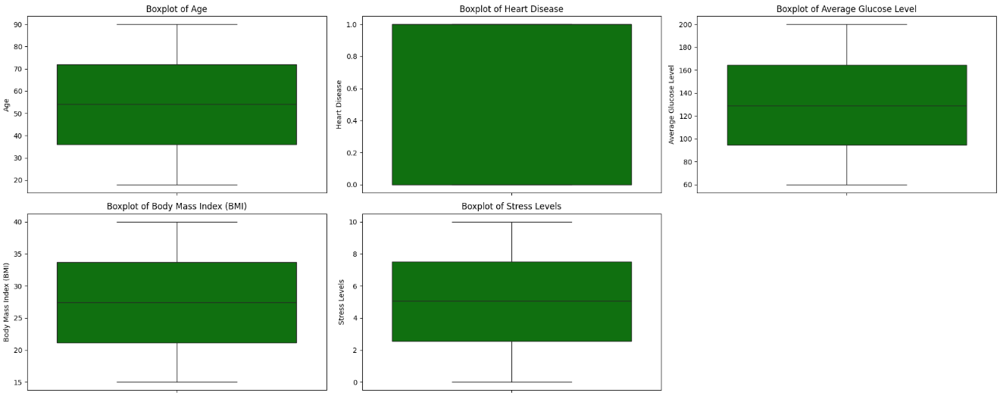

# Laporan Proyek Machine Learning Prediksi Stroke Berdasarkan Kebiasaan Sehari-hari - Fajri Haryanto

## Domain Proyek

Stroke merupakan salah satu penyakit yang memiliki tingkat kematian dan kecacatan tertinggi secara global. Organisasi Kesehatan Dunia (WHO) mencatat bahwa sekitar 15 juta orang di dunia mengalami stroke setiap tahunnya, dan sepertiganya mengalami kematian [1]. Di Indonesia, prevalensi stroke juga cukup tinggi, khususnya pada kelompok usia produktif. Hal ini menimbulkan dampak sosial dan ekonomi yang besar, baik bagi individu, keluarga, maupun negara [2].

Prediksi stroke secara dini menjadi krusial untuk menurunkan angka kejadian dan mempercepat intervensi medis. Namun, pemeriksaan konvensional seperti CT-scan atau MRI umumnya hanya dilakukan ketika gejala sudah muncul. Oleh karena itu, pendekatan prediksi berbasis machine learning (ML) menggunakan data kebiasaan sehari-hari dan faktor demografis dinilai lebih adaptif, ekonomis, dan mudah diakses.

Dalam proyek ini, **dikembangkan sebuah sistem prediksi risiko stroke dengan memanfaatkan algoritma Random Forest/KNN, Boosters Algorithm**. Model ini dilatih menggunakan data demografis (usia, jenis kelamin), gaya hidup (kebiasaan merokok, aktivitas fisik), serta kondisi kesehatan (tekanan darah, diabetes, dan lain-lain) untuk mengidentifikasi individu dengan potensi risiko tinggi terhadap stroke.

**Urgensi Masalah**
Deteksi dini terhadap risiko stroke memiliki peran penting dalam proses pencegahan dan pengobatan. Sayangnya, masih banyak masyarakat yang tidak menyadari bahwa gaya hidup sehari-hari berperan besar dalam meningkatkan risiko stroke. Selain itu, akses terhadap teknologi diagnostik masih terbatas, terutama di daerah dengan fasilitas kesehatan minimal.

Dengan meningkatnya ketersediaan data kesehatan dan kemajuan teknologi ML, muncul peluang untuk mengembangkan sistem prediktif yang mampu memberikan peringatan dini secara otomatis dan akurat. Penelitian ini mencoba menjawab kebutuhan tersebut dengan mengembangkan model prediksi stroke berbasis data kebiasaan harian.

**Tujuan Penelitian**
Tujuan dari proyek ini adalah:

1. Menganalisis dan mengolah data kebiasaan sehari-hari dan data demografis untuk membangun model prediksi risiko stroke.

2. Mengimplementasikan algoritma Random Forest untuk menghasilkan klasifikasi yang akurat antara individu berisiko dan tidak berisiko stroke.

3. Memberikan solusi yang dapat membantu masyarakat dan tenaga medis dalam melakukan deteksi dini secara digital dan preventif.

## Business Understanding

Pemahaman bisnis merupakan langkah krusial dalam pengembangan sistem prediksi berbasis machine learning. Tahapan ini berfokus pada klarifikasi permasalahan yang hendak diselesaikan serta perumusan tujuan yang ingin dicapai, agar model yang dikembangkan dapat memberikan nilai nyata dalam konteks dunia nyata dalam hal ini, prediksi risiko stroke berdasarkan kebiasaan sehari-hari dan faktor demografis.

### Problem Statements

1. urangnya deteksi dini terhadap risiko stroke di masyarakat.
   Banyak individu tidak menyadari bahwa mereka memiliki risiko tinggi terkena stroke karena keterbatasan akses terhadap pemeriksaan medis dan rendahnya kesadaran terhadap faktor risiko sehari-hari.

2. Data kesehatan yang tersedia bersifat mentah dan tidak langsung dapat digunakan untuk prediksi.
   Data mentah seringkali mengandung outlier, nilai kosong, serta representasi fitur yang tidak seragam, sehingga memerlukan proses pembersihan dan transformasi agar model machine learning dapat mempelajarinya dengan efektif.

3. Belum ada model pembanding yang teruji untuk menentukan algoritma mana yang paling optimal.
   Pemilihan algoritma machine learning tanpa eksperimen dan evaluasi yang sistematis dapat menghasilkan prediksi yang tidak akurat dan tidak dapat diandalkan dalam situasi nyata.

### Goals

1. Mengembangkan model prediktif yang mampu mengidentifikasi individu dengan risiko tinggi stroke secara akurat.
   Model ini diharapkan mampu memberikan peringatan dini berdasarkan faktor gaya hidup dan kondisi kesehatan umum.

2. Melakukan proses eksplorasi dan transformasi data (EDA, outlier handling, encoding, normalization) agar data siap digunakan untuk pelatihan model.
   Ini akan memastikan bahwa informasi penting dalam data dapat ditangkap secara optimal oleh algoritma yang digunakan.

3. Membandingkan performa beberapa algoritma (Random Forest, K-Nearest Neighbors, dan Booster Algorithm) untuk menemukan model dengan akurasi dan generalisasi terbaik.
   Hasil evaluasi dari berbagai model akan menjadi dasar dalam pemilihan model akhir yang akan digunakan untuk prediksi.

### Solution statements

1. Penggunaan dan evaluasi tiga algoritma klasifikasi: Random Forest, K-Nearest Neighbors (KNN), dan Booster Algorithm (Gradient Boosting).
   Ketiga algoritma ini dipilih karena memiliki pendekatan berbeda dalam melakukan klasifikasi, sehingga dapat saling dibandingkan untuk menentukan metode terbaik berdasarkan performa akurasi, precision, recall, dan F1-score.

2. Melakukan penerapan proses preprocessing menyeluruh yang mencakup:

   - Exploratory Data Analysis (EDA): untuk memahami distribusi data dan hubungan antar fitur.

   - Outlier handling: menggunakan metode seperti IQR untuk mengurangi pengaruh nilai ekstrem.

   - Encoding fitur kategorikal: menggunakan Label Encoder atau One-Hot Encoding untuk membuat data numerik yang dapat dimengerti oleh algoritma.

   - Normalisasi fitur: menggunakan StandardScaler untuk menyamakan skala nilai agar model tidak bias terhadap fitur tertentu.

   - Split data 80:20: membagi dataset menjadi data latih dan data uji untuk mengevaluasi performa secara objektif.

3. Evaluasi performa menggunakan metrik yang terukur:
   Untuk menjamin kualitas model, digunakan metrik evaluasi yang mencakup accuracy, precision, recall, dan F1-score. Dengan ini, pemilihan model terbaik tidak hanya didasarkan pada akurasi saja, tetapi juga pada kemampuan mendeteksi kelas minoritas (stroke).

## Data Understanding

Dataset yang digunakan dalam penelitian ini berasal dari Kaggle - Stroke Prediction Dataset, yang telah mengalami modifikasi untuk menambahkan beberapa fitur relevan guna meningkatkan kualitas prediksi. Dataset ini mencakup data demografis, kebiasaan sehari-hari, dan riwayat kesehatan individu. Data tersebut terdiri dari 13 fitur input dan 1 fitur target, yaitu stroke, yang bersifat biner (0 = tidak terkena stroke, 1 = terkena stroke).

### Variabel-variabel pada Restaurant UCI dataset adalah sebagai berikut:

Berikut adalah penjelasan setiap variabel dalam dataset:

- age: usia pasien (numerik)

- gender: jenis kelamin pasien (kategori: Male, Female, Other)

- heart_disease: apakah pasien memiliki riwayat penyakit jantung (biner: 0 atau 1)

- work_type: jenis pekerjaan pasien (kategori: Private, Self-employed, Govt_job, Children, Never_worked)

- Residence_type: tempat tinggal pasien (kategori: Urban, Rural)

- avg_glucose_level: rata-rata kadar glukosa darah (numerik, mg/dL)

- bmi: indeks massa tubuh (Body Mass Index) (numerik)

- smoking_status: status merokok pasien (kategori: formerly smoked, never smoked, smokes, unknown)

- alcohol_intake: frekuensi konsumsi alkohol (kategori atau ordinal: Low, Moderate, High)

- physical_activity: tingkat aktivitas fisik (kategori: Low, Moderate, High)

- family_history_of_stroke: apakah memiliki riwayat keluarga terkena stroke (biner: 0 atau 1)

- dietary_habits: pola makan (kategori: Balanced, Unbalanced)

- stress_levels: tingkat stres (kategori atau ordinal: Low, Moderate, High)

- stroke: target variabel, apakah pasien pernah mengalami stroke (biner: 0 = tidak, 1 = ya)

### Exploratory Data Analysis (EDA)

Untuk memahami karakteristik dan distribusi data, dilakukan analisis eksploratif menggunakan teknik visualisasi seperti histogram, heatmap korelasi, dan countplot.

## Data Preparation

Data preparation merupakan tahap penting untuk memastikan model dapat bekerja secara optimal. Pada tahap ini dataset yang digunakan saat dicek, tidak ditemukan mssing value maupun duplikasi data. Adapaun beberapa teknik preprocessing data yang kami terapkan

1. Encoding Fitur Kategorikal
   Fitur kategorikal seperti gender, work_type, Residence_type, smoking_status, dan lainnya diubah menjadi representasi numerik menggunakan Label encoder

2. Outlier Handling
   Deteksi dan penanganan outlier dilakukan dengan:

Menggunakan IQR method pada variabel numerik seperti bmi dan avg_glucose_level dan fitur numerik lainnya

Outlier yang ekstrem dipotong (capping) agar tidak mengganggu distribusi data.

3. Normalization
   Normalisasi dilakukan menggunakan StandardScaler untuk menstandarkan skala fitur numerik agar memiliki mean = 0 dan standar deviasi = 1, terutama untuk algoritma yang sensitif terhadap skala seperti KNN dan Boosting.

4. Data Splitting
   Dataset dibagi menjadi:

Training set: 80%

Test set: 20%
Pembagian ini bertujuan untuk melatih model pada sebagian besar data dan menguji performanya pada data yang belum pernah dilihat.

## Modeling

Dalam proyek ini digunakan tiga algoritma klasifikasi, yaitu K-Nearest Neighbors (KNN), Random Forest, dan Gradient Boosting. Ketiga algoritma ini dipilih karena masing-masing memiliki karakteristik yang sesuai dengan kompleksitas dan tipe data pada kasus prediksi stroke, yang melibatkan fitur-fitur numerik, kategorik, serta distribusi target yang tidak seimbang.

1. K-Nearest Neighbors (KNN)
   Parameter: n_neighbors=30, p=1, weights='distance'

Alasan Pemilihan: KNN dipilih karena metode ini sederhana namun efektif untuk mendeteksi pola pada data berbasis jarak. Parameter weights='distance' membuat model memberi bobot lebih pada tetangga yang lebih dekat, meningkatkan akurasi pada data dengan sebaran kompleks.

2. Random Forest
   Parameter: n_estimators=300, max_depth=15, min_samples_leaf=4, min_samples_split=10, class_weight='balanced'

Alasan Pemilihan: Random Forest unggul dalam menangani fitur yang saling berinteraksi dan mencegah overfitting melalui teknik ensemble. Penyesuaian parameter dilakukan agar model tidak terlalu dalam (menghindari overfitting) dan menangani ketidakseimbangan kelas dengan class_weight='balanced'.

3. Gradient Boosting
   Parameter: n_estimators=300, learning_rate=0.05, max_depth=5, subsample=0.8

Alasan Pemilihan: Algoritma ini memperbaiki kesalahan model secara iteratif, sangat cocok untuk meningkatkan performa klasifikasi dalam dataset yang kompleks. Kombinasi learning_rate dan subsample membantu menghindari overfitting.

## Evaluation

| Metrik    | K-Nearest Neighbor | Random Forest | Boosting Algorithm |
| --------- | ------------------ | ------------- | ------------------ |
| Accuracy  | 87.50%             | 89.00%        | **89.20%**         |
| Precision | **86.62%**         | 79.98%        | 80.57%             |
| Recall    | 66.47%             | **90.86%**    | 79.36%             |
| F1 Score  | 69.38%             | **83.47%**    | 79.94%             |

Hasil menunjukkan bahwa Boosting Algorithm memberikan akurasi terbaik secara keseluruhan (89.20%), namun Random Forest unggul dalam hal recall (90.86%) dan F1-score (83.47%), menjadikannya kandidat kuat untuk kasus klasifikasi dengan kebutuhan sensitivitas tinggi terhadap kasus positif (stroke). Sementara itu, KNN menunjukkan precision tinggi namun performa recall rendah, yang menunjukkan kecenderungan model untuk memprediksi negatif secara dominan.

| Model              | Akurasi Train | Akurasi Test |
| ------------------ | ------------- | ------------ |
| K-Nearest Neighbor | 100.00%       | 87.50%       |
| Random Forest      | 94.10%        | 89.00%       |
| Boosting           | 99.41%        | 89.20%       |

Model KNN menunjukkan gejala overfitting karena akurasi pelatihan 100% namun akurasi pengujian hanya 87.5%. Model Boosting dan Random Forest menunjukkan keseimbangan yang lebih baik antara akurasi pelatihan dan pengujian, menandakan generalisasi yang lebih baik terhadap data baru.
**Rubrik/Kriteria Tambahan (Opsional)**:

**Model Terbaik & Conclusion**
Dalam proyek ini, telah dikembangkan sistem klasifikasi risiko stroke berbasis machine learning menggunakan dataset yang mencerminkan faktor-faktor penting seperti usia, riwayat kesehatan, gaya hidup, dan kebiasaan pasien. Melalui tahapan modeling dan evaluasi, tiga algoritma diuji: K-Nearest Neighbor, Random Forest, dan Gradient Boosting.

Hasil evaluasi menunjukkan bahwa Random Forest merupakan model terbaik berdasarkan metrik akurasi, recall, dan F1-score yang unggul, serta kestabilan performa antara data pelatihan dan pengujian. Dengan recall mencapai 90.86%, model ini sangat cocok untuk konteks medis yang membutuhkan sensitivitas tinggi terhadap risiko penyakit serius seperti stroke. Selain itu, Random Forest mampu menangani ketidakseimbangan kelas dalam data secara efektif melalui parameter class_weight='balanced'.

Dengan performa yang seimbang, interpretabilitas yang baik, dan ketahanan terhadap overfitting, model ini dapat diadopsi sebagai pendukung pengambilan keputusan dalam diagnosis dini stroke, membantu meningkatkan efisiensi penanganan dan pencegahan penyakit secara lebih tepat sasaran.

## Referensi

1. World Health Organization, “The top 10 causes of death,” WHO, 2020.  
   [Online]. Available: [https://www.who.int/news-room/fact-sheets/detail/the-top-10-causes-of-death](https://www.who.int/news-room/fact-sheets/detail/the-top-10-causes-of-death)

2. Riset Kesehatan Dasar (Riskesdas), “Laporan Nasional Riskesdas 2018,” Badan Penelitian dan Pengembangan Kesehatan, Kemenkes RI, 2018. ISBN: 978-602-6900-97-0.

3. A. Tashkova, S. Eftimov, B. Ristov, and S. Kalajdziski, “Comparative Analysis of Stroke Prediction Models Using Machine Learning,” _arXiv preprint_ arXiv:2505.09812, May 2025.  
   [Online]. Available: [https://arxiv.org/abs/2505.09812](https://arxiv.org/abs/2505.09812)

4. L. Ismail and H. Materwala, “From Conception to Deployment: Intelligent Stroke Prediction Framework Using Machine Learning and Performance Evaluation,” _arXiv preprint_ arXiv:2304.00249, Apr. 2023.  
   [Online]. Available: [https://arxiv.org/abs/2304.00249](https://arxiv.org/abs/2304.00249)

5. S. Dev, H. Wang, C. S. Nwosu, N. Jain, and B. Veeravalli, “A Predictive Analytics Approach for Stroke Prediction Using Machine Learning and Neural Networks,” _arXiv preprint_ arXiv:2203.00497, Mar. 2022.  
   [Online]. Available: [https://arxiv.org/abs/2203.00497](https://arxiv.org/abs/2203.00497)

6. C. Fernandez-Lozano et al., “Random Forest-Based Prediction of Stroke Outcome,” _arXiv preprint_ arXiv:2402.00638, Feb. 2024.  
   [Online]. Available: [https://arxiv.org/abs/2402.00638](https://arxiv.org/abs/2402.00638)

7. E. Augi and A. Sultan, “The Early Warning Signs of a Stroke: An Approach Using Machine Learning Predictions,” _Journal of Computer and Communications_, vol. 12, pp. 59–71, 2024.  
   DOI: [10.4236/jcc.2024.126005](https://doi.org/10.4236/jcc.2024.126005)

**---Fajri Haryanto---**
